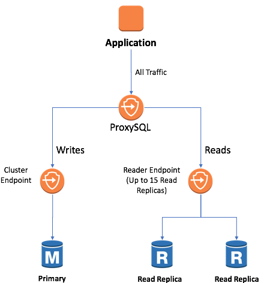

## Amazon Aurora ProxySQL example

A set of CloudFormation templates that demonstrates using ProxySQL middleware to provide a single endpoint for both the primary and read replica instances of an Amazon Aurora MySql-compatible cluster.

These CloudFormation (CFN) templates deploy an Aurora RDS MySql-compatible
cluster with proxysql middleware. ProxySQL offers a single endpoint that directs traffic
to the RDS cluster endpoint for writes and the RDS reader endpoint for reads.

The templates also set up a VPC with public and private subnets, security groups that 
limit communication, and an ELB to expose the proxysql instance externally.

## License Summary

This sample code is made available under a modified MIT license. See the LICENSE file.

## Setup

We assume that you have the AWS CLI installed and configured.  Create an S3 bucket
to contain the CFN templates.  We'll refer to this as `templatebucket`.

In the scripts `create.sh` and `update.sh`, review and update the parameters.  You must
put in your own SSH key name in the `keyname` parameter, and we strongly encourage you to
change the `AllowedCidrIngress` from the default of `0.0.0.0/0`.

## Create the CFN stack

Run:

    ./create.sh templatebucket proxysql proxysqlstack us-west-2

Use your AWS region of choice if you don't want to run in `us-west-2`.

## Updating the stack

You can run the following to update the stack if you change the configuration:

    ./update.sh templatebucket proxysql proxysqlstack us-west-2

## Using the stack

Look for the stack output parameter `Endpoint`.  You can use `Endpoint:3306` as your
MySql-compatible connection host.

## License Summary

This sample code is made available under a modified MIT license. See the LICENSE file.
